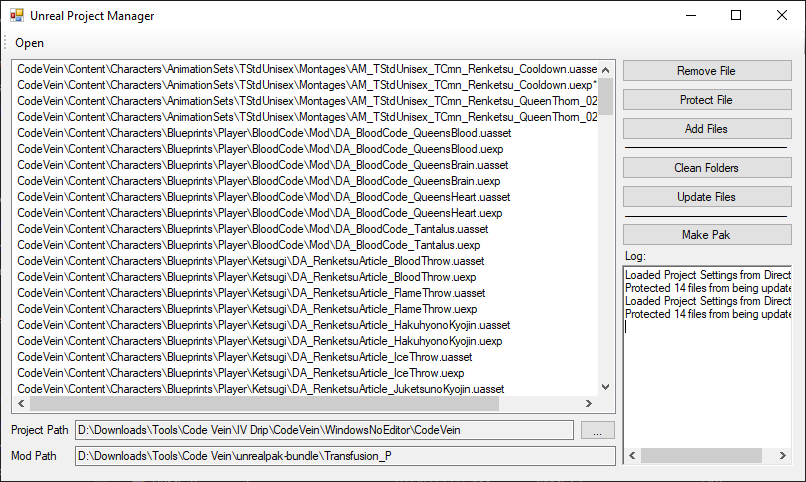

# Unreal Project Manager
  
A simple GUI program for managing unreal modding projects

## Overview
**Requires UnrealPak for making paks**  
Use "Open" to open the base path of your mod, usually named "[Mod Name]_P".  
Use the "..." next to Project Path to set the export directory of your unreal project, which should be something like "WindowNoEditor\CodeVein".  
"Remove File" will delete the selected file from your mod project.  
"Protect File" will prevent the selected file from being updated, useful for manually edited files.  
"Add Files" will open a dialog where you can copy any file from your unreal project to your mod project.  
"Clean Folders" will delete any empty directories in your mod project.  
"Update Files" will copy every unprotected file in the main list from your unreal project to your mod project.  
"Make Pak" will make a compressed .pak file of your mod project.  

